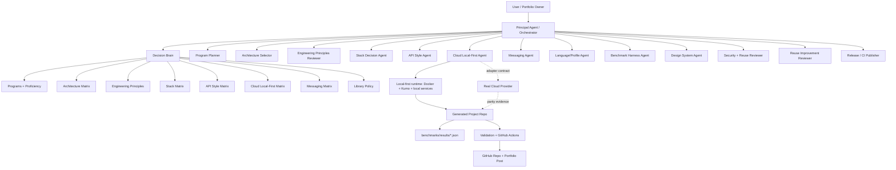

# Agent Graph

The agent graph is the operating model for using this kit. It defines how a principal agent, specialist subagents, local-first infrastructure, benchmark harness, validation, and GitHub publication work together.

It is not tied to one tool. Codex, Claude Code, another agent runtime, or a human can follow the same graph. If a runtime cannot spawn subagents, the principal agent executes the subagent roles sequentially and records the same evidence.

## Why This Exists

The portfolio should not be a set of disconnected repositories. Each project needs a repeatable path from idea to proof:

```txt
objective -> program -> architecture -> principles -> stack -> API -> cloud/local-first -> messaging -> implementation -> benchmark -> validation -> publication
```

The graph prevents three common failures:

- choosing architecture by framework habit instead of problem forces
- using Kafka, RabbitMQ, GraphQL, cloud, or microservices without a benchmark-backed reason
- publishing a repo that has code but no portfolio story, decision record, or reproducible number

## Graph



## Subagent Responsibility Matrix

| Subagent | Main Question | Required Output |
|---|---|---|
| `program-planner` | Which portfolio program does this strengthen? | `project.yaml:program`, SDD portfolio fit. |
| `architecture-selector` | Which architecture fits the problem forces? | `sdd/architecture-decision.md`, dependency rule, rejected alternatives. |
| `engineering-principles-reviewer` | Are decoupling, SOLID, LSP, KISS, YAGNI, DRY, and testability explicit? | `decision_brain.principles`, technical decision evidence. |
| `stack-decision-agent` | Which concrete stack proves the claim best? | Stack profile, language profile, rejected stack alternatives. |
| `api-style-agent` | Should the project expose REST, GraphQL, gRPC, WebSocket, SSE, or CLI? | API contract and benchmark-relevant API rationale. |
| `cloud-local-first-agent` | How does this run locally while staying cloud-pluggable? | Docker/Kumo/local runtime, adapter boundary, parity tests. |
| `messaging-agent` | Does the problem need no broker, outbox, RabbitMQ, Kafka, Redis Streams, or NATS? | Messaging decision and failure-mode benchmark. |
| `language-profile-agent` | What repo layout and tooling does the chosen stack require? | Framework-specific folders, tests, linting, Docker path. |
| `benchmark-harness-agent` | What number proves the claim? | Benchmark plan, command, JSON result, README table. |
| `design-system-agent` | Does the repo look consistent with the portfolio? | README structure, diagram style, metric presentation. |
| `security-reuse-reviewer` | Are secrets, paid paths, and reuse attribution clean? | `REFERENCES.md`, release checklist, no-token review. |
| `reuse-improvement-reviewer` | Should this project improve the reuse kit? | `sdd/reuse-improvement-review.md`, optional kit patch. |
| `release-ci-publisher` | Is the repo publishable? | Validation, commit, push, CI status. |

## Local-First Runtime

Local-first is the default proof path. The generated project should run with Docker and local services before any real cloud dependency is introduced.

For AWS-like behavior, use [sivchari/kumo](https://github.com/sivchari/kumo) as the local-first provider. Real AWS, or another cloud, is only an adapter behind ports. This protects the architecture and makes the default demo reproducible without paid credentials.

Required rules:

- domain and use cases do not import cloud SDKs
- local and real adapters implement the same port contract
- parity tests cover the behavior the benchmark depends on
- the default README command does not require a secret
- real cloud is enabled through configuration, not by changing business code

## Handoff Contract

Before implementation starts, the principal agent must produce or update:

- `project.yaml`
- `sdd/spec.md`
- `sdd/architecture-decision.md`
- `sdd/technical-decision.md`
- `sdd/benchmark-plan.md`
- `sdd/agent-handoff.md`
- `sdd/reuse-improvement-review.md`

Before publication, the release path must prove:

- Docker path works
- benchmark result exists as JSON
- README opens with number, claim, and result
- reuse is attributed in `REFERENCES.md`
- validation passes

## Decision Rules

- Use the simplest architecture that proves the claim.
- Do not add a broker without async semantics, retry, ordering, replay, routing, or durability requirements.
- Do not choose GraphQL when simple HTTP endpoints better match the caller and benchmark.
- Do not choose real cloud as the default path when Kumo or a local adapter proves the same behavior.
- Do not let framework, ORM, cloud, broker, transport, or UI dependencies enter domain and use cases.
- Reject dependencies that hide the concept the repository exists to demonstrate.
