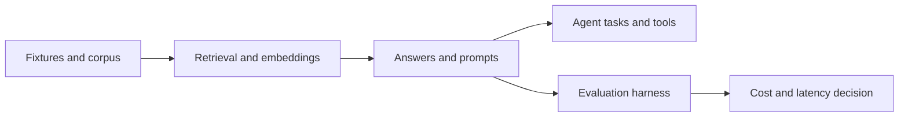

# AI Evaluation and Retrieval Systems

This is the first portfolio program. It is a system of six repositories, not
six unrelated demos.

## System Claim

The program proves that LLM and retrieval decisions can be evaluated locally
with explicit quality, latency, cost, and task-success evidence before a real
provider is introduced.

## Repository Map

| # | Repository | System responsibility | Headline benchmark |
|---:|---|---|---|
| 2 | `llm-eval-harness` | Answer-quality metrics and deterministic fixtures | F1 = 0.8449 |
| 3 | `rag-knowledge-base` | Ingestion, retrieval, grounded context, and HTTP serving | Recall@3 = 1.00; p95 = 30.76 ms |
| 8 | `embeddings-benchmark` | Compare embedding providers and retrieval behavior | Best Recall@3 = 1.00 |
| 9 | `llm-agent-eval` | Evaluate tool routing and task outcomes | Task success = 1.00 |
| 10 | `prompt-ab-testing` | Compare prompt variants with a reproducible score | Best variant score = 1.00 |
| 30 | `cost-aware-inference` | Compare local and API cost/latency assumptions | API cost = USD 0.0007 / 1k tokens |

Numbers must be read from each repository's committed JSON result, not copied
manually into this page. The values above are the current Docker/local proof
snapshot used to order the first posts.

## Shared Architecture



The shared boundary is deliberately small:

- deterministic local fixtures are the default proof;
- domain and use cases do not import provider SDKs;
- provider, vector store, and transport integrations stay behind ports/adapters;
- CLI is the default interface for benchmark-oriented repos;
- REST/HTTP is used by `rag-knowledge-base` because it proves serving behavior;
- GraphQL, brokers, and paid model credentials are rejected until a benchmark
  requires them;
- every repo uses the same JSON benchmark contract and reuse-improvement gate.

## Dependency Direction

```txt
program contract
  -> project manifest and component pack
  -> architecture and stack decision
  -> local fixture/use case
  -> adapter or interface
  -> benchmark JSON
  -> README/post number
  -> reuse improvement
```

The program shares decisions and evidence formats, not hidden runtime coupling.
Each repository remains independently runnable and publishable.

## Post Sequence

1. `llm-eval-harness`: establish objective answer-quality metrics.
2. `rag-knowledge-base`: show retrieval and grounded context from first principles.
3. `embeddings-benchmark`: justify embedding choices with Recall@k and timing.
4. `llm-agent-eval`: extend evaluation to tools and task outcomes.
5. `prompt-ab-testing`: compare prompt changes without relying on anecdotes.
6. `cost-aware-inference`: close the loop with local/API economics.

## Operating Command

From `portfolio-reuse-kit`, prepare any member without rebuilding the process:

```powershell
powershell -ExecutionPolicy Bypass -File tools/prepare-project.ps1 `
  -RepoPath (Join-Path $HOME "repos-github/rag-knowledge-base") `
  -ChangeId baseline `
  -Force `
  -Validate
```

The command produces the agent context card, OpenSpec change package, SDD
artifacts, article draft, voice check, and validation result for that member.
