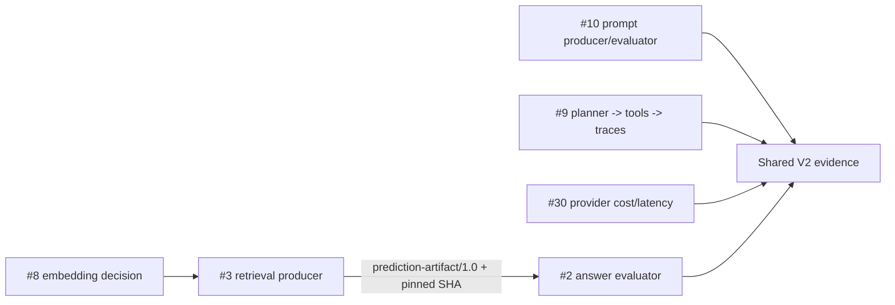

# AI Evaluation and Retrieval Systems

Status: **complete, 6/6 repositories on `main`, exact-head CI green**.

| # | Repository | Responsibility | Published proof |
|---:|---|---|---|
| 3 | `rag-knowledge-base` | Retrieve and export versioned prediction artifacts | Recall@3 `1.00`; p95 `0.4474 ms` |
| 2 | `llm-eval-harness` | Evaluate the exact pinned RAG producer artifact | F1 `0.5718`; EM `0.00`; 4 cases |
| 8 | `embeddings-benchmark` | Compare revision-locked dense encoders | Recall@3 `0.875` tie; BGE `4.93x` faster |
| 9 | `llm-agent-eval` | Run and evaluate a local tool-routing graph | task `62.5%`; tool `87.5%`; p95 `3006.96 ms` |
| 10 | `prompt-ab-testing` | Generate and blindly compare real prompt outputs | concise `0.80` vs baseline `0.00`; uplift `+0.80` |
| 30 | `cost-aware-inference` | Compare local LLM HTTP and non-LLM reference | p95 `1011.02` vs `0.2399 ms`; `4213.51x` |

```mermaid
flowchart LR
  RAG["#3 retrieval producer"] -->|"prediction-artifact/1.0 + pinned SHA"| Eval["#2 answer evaluator"]
  Embed["#8 embedding decision"] --> RAG
  Prompt["#10 prompt producer/evaluator"] --> Evidence["Shared V2 evidence"]
  Agent["#9 planner -> tools -> traces"] --> Evidence
  Cost["#30 provider cost/latency"] --> Evidence
  Eval --> Evidence
```

## Stack

- Python 3.12, standard-library HTTP, FastAPI, FastEmbed 0.8.0, ONNX Runtime, Ollama/OpenAI-compatible API, JSON/JSONL, JSON Schema, Docker, PowerShell validation, GitHub Actions.
- Local-first inference: pinned `qwen2.5-coder:0.5b`; cloud remains replaceable behind the compatible HTTP port.
- Retrieval/evaluation coupling: file contract plus exact producer commit, never source imports.

## Reuse Extracted

- `prediction-artifact.schema.json` and `producer-lock.schema.json`.
- `local-first-ai-evidence` skill for Codex and Claude.
- Cross-platform native-process validation that uses exit codes without treating unittest stderr as a PowerShell exception.
- Fail-closed model revision/digest checks and explicit negative-result reporting.
