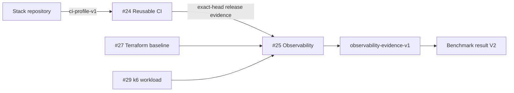

# Delivery, Observability, And Infrastructure

This macro proves one operational path across four focused repositories. CI supplies executable gates, observability shortens incident recovery, Terraform provisions interchangeable infrastructure, and k6 applies reproducible load. The repositories share contracts and evidence rules, not application source code.

## Repository Responsibilities

| # | Repository | Responsibility | Publication state |
|---:|---|---|---|
| 24 | `ci-cd-templates` | Execute and secure reusable Python, Go, Node, JVM/Gradle, and Terraform workflows | Published |
| 25 | `observability-stack` | Correlate traces, metrics, and logs and measure a real controlled HTTP incident | Published |
| 27 | `terraform-aws-baseline` | Provision one shared Terraform module through Kumo locally and AWS by provider switch | Published |
| 29 | `load-test-suite` | Reuse k6 scenarios and publish the p95 load curve of real endpoints | Next |

## Contract Flow

`ci-profile-v1` identifies the workflow by immutable source commit, runtime and explicit commands, supply-chain controls, executable fixture, zero static findings, and exact-head CI run. It does not force all repositories onto one universal command script.

`observability-evidence-v1` requires at least three real `200 -> 503 -> 200`
runs, monotonic timing, unique lifecycle trace IDs, correlation rate `1.0`,
non-root named-volume evidence, full backend health/navigation, immutable
provenance, full Git history for source validation, and exact-head CI.

`terraform-kumo-lifecycle-v1` requires a real provider-driven apply/destroy lifecycle, one warmup plus at least three measured runs, identical resource counts, parity `1.0`, no failed cycle, no cloud credential, one shared module across Kumo and AWS roots, and an explicit denial of full AWS conformance.

## Decoupling Rules

- Stack-specific commands stay in explicit workflow profiles; project domain code does not depend on CI implementation.
- Telemetry is emitted through standard ports and semantic attributes; dashboards do not become application dependencies.
- OTLP is the local-to-cloud switch. Domain and application code never import telemetry backends or cloud SDKs.
- Fast evidence and full exploration are separate profiles. Prometheus, Tempo, Loki, and Grafana are included only when they prove navigation across signals.
- Tempo 3 runs monolithically for this workload; Kafka is rejected because there is no distributed ingest requirement.
- Terraform resource declarations live in one shared module. Kumo and AWS roots differ only in provider configuration and environment policy; `terraform_data` is not accepted as provisioning proof.
- k6 workloads consume public service contracts and versioned fixtures, never internal application modules.
- Static guardrail latency, hosted build time, MTTR, provision time, and load p95 remain separate benchmarks with separate comparability keys.

## Completion Gate

Each repository needs a credential-free local Docker path, README headline number, benchmark result V2, clean source provenance, and successful CI at the exact final `main`. Current progress is **3/4**; #29 is the sole remaining repository.
