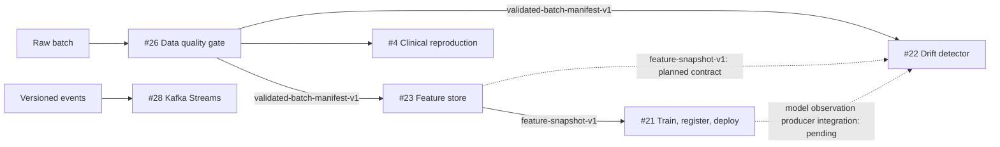

# MLOps And Data Platform

This macro is one evidence system, not six unrelated demos. It proves that data can be rejected safely, identified immutably, materialized as features, used by a real training lifecycle, evaluated in a clinical reproduction, observed for drift, and processed as a stream.

## Repository Responsibilities

| # | Repository | Responsibility | Publication state |
|---:|---|---|---|
| 26 | `data-quality-checks` | Fail-closed structural and row gate; accepted/quarantine artifacts and manifest | Published |
| 23 | `feature-store-lite` | Fail-closed validated-batch ingestion, point-in-time-correct feature materialization, and online reads | Published |
| 21 | `mlops-end2end` | Airflow execution, MLflow registry, deploy and monitor lifecycle | Published |
| 4 | `stroke-signal-demo` | Reproducible clinical classifier and held-out evaluation | Pending |
| 22 | `model-drift-detector` | Fail-closed baseline/current feature and prediction drift alarms with model identity | Published |
| 28 | `kafka-streams-demo` | Stateful streaming and message-rate evidence | Published |

## Artifact Flow

The arrows are artifact contracts, not source imports or a claim that every repository is deployed together. The central contract is `contracts/mlops-data-platform.yaml`; `contracts/validated-batch-manifest-v1.schema.json` is the first implemented cross-repository boundary.

## Decoupling Rules

- Domain and application policy do not import Pandera, Polars, Feast, Airflow, MLflow, Kafka, storage SDKs, or transports.
- Adapters depend inward on ports and versioned contracts. Consumers validate schema version, contract identity, quality status, and digest before reading an artifact.
- Substitution is proved with reference-versus-optimized adapter parity where multiple implementations exist.
- Each repository keeps one focused proof and benchmark. Infrastructure is added only when it participates in that proof.
- Docker is the local-first runtime. Cloud equivalents stay plug-compatible behind project-owned ports; Kumo is selected only for AWS behavior that must be emulated.

## Completion Gate

A component is publication-complete only when Docker execution, README headline numbers, canonical V2 evidence, reproducible smoke evidence, and exact-head CI all pass. Current progress is 5/6. The macro closes after #4 consumes compatible validated clinical inputs and preserves split/model identity. The direct `feature-snapshot-v1` and lifecycle observation-producer arrows remain explicitly unclaimed until both sides implement them.
